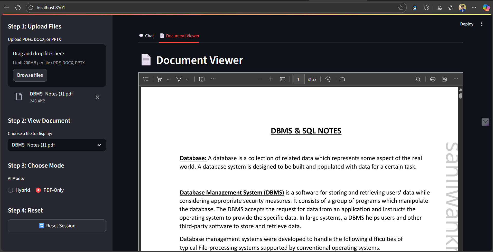

# ManthanAI: Your AI Document Analyst 🤖 

[](https://your-app-url.streamlit.app/) <-- **REPLACE THIS URL AFTER DEPLOYMENT**

ManthanAI is a sophisticated, AI-powered chat application that allows you to have intelligent conversations with your documents. Upload PDFs, DOCX files, or PPTX presentations, and get accurate, context-aware answers instantly.

The application leverages a state-of-the-art Retrieval-Augmented Generation (RAG) pipeline, combining keyword and semantic search with an advanced re-ranking model to ensure the highest possible accuracy.

[➡️ **View the Live Demo**](https://your-app-url.streamlit.app/) 

## 📸 Application Preview



## ✨ Key Features

*   **Multi-Format Support**: Upload and analyze `.pdf`, `.docx`, and `.pptx` files.
*   **Advanced RAG Pipeline**:
    *   **Hybrid Search**: Combines keyword-based (BM25) and semantic vector search (FAISS) to get the best of both worlds—exact matches and contextual understanding.
    *   **Re-Ranking**: Uses Cohere's `rerank` model to intelligently re-order retrieved documents for maximum relevance to your question.
*   **Dual AI Modes**:
    *   **Hybrid Mode**: Answers from your documents first. If the information isn't there, it uses its general knowledge to provide a helpful response.
    *   **PDF-Only Mode**: Strictly answers based *only* on the information present in the uploaded documents.
*   **Interactive UI**:
    *   **Document Viewer**: View your uploaded documents directly within the app in a separate tab.
    *   **Chat History**: Keeps track of your current conversation.
    *   **Source Citing (Coming Soon)**: The backend is built to identify source documents for each answer.
*   **Session Management**: A "Reset Session" button allows you to clear the documents and chat history to start fresh.

## 🛠️ Technology Stack

*   **Frontend**: [Streamlit](https://streamlit.io/)
*   **Backend**: Python
*   **AI & LLM Orchestration**: [LangChain](https://www.langchain.com/)
*   **AI Models & Services**:
    *   **Generative LLM**: [Google Gemini Pro / Gemini 1.5 Flash](https://ai.google.dev/)
    *   **Embeddings**: `models/embedding-001` via Google Generative AI
    *   **Re-ranking**: [Cohere Rerank English v3.0](https://cohere.com/)
*   **Vector Search & Storage**:
    *   **Semantic Search**: [FAISS (Facebook AI Similarity Search)](https://github.com/facebookresearch/faiss)
    *   **Keyword Search**: [rank_bm25](https://pypi.org/project/rank-bm25/)
*   **Document Parsing**: `PyMuPDF` (for PDFs), `python-docx` (for DOCX), `python-pptx` (for PPTX), `mammoth` (for DOCX viewing).

## 🚀 Getting Started: Running Locally

To run this application on your local machine, follow these steps.

### 1. Prerequisites

*   Python 3.8 - 3.11
*   A Git client

### 2. Clone the Repository

```bash
git clone https://github.com/your-username/your-repository-name.git
cd your-repository-name
```

### 3. Set Up a Virtual Environment

It's highly recommended to use a virtual environment to manage dependencies.

**On macOS/Linux:**
```bash
python3 -m venv venv
source venv/bin/activate
```

**On Windows:**
```bash
python -m venv venv
.env\Scriptsctivate
```

### 4. Install Dependencies

Install all the required Python libraries using the requirements.txt file.

```bash
pip install -r requirements.txt
```

### 5. Configure API Keys

This application requires API keys from Google and Cohere. It uses Streamlit's Secrets Management.

Create a new folder in the root directory named `.streamlit`.

Inside this folder, create a file named `secrets.toml`.

```toml
# .streamlit/secrets.toml

GEMINI_API_KEY = "YOUR_GOOGLE_GEMINI_API_KEY"
COHERE_API_KEY = "YOUR_COHERE_API_KEY"
```

### 6. Run the Application

You're all set! Launch the Streamlit app with the following command:

```bash
streamlit run app.py
```

The application should now be open and running in your web browser.

## ☁️ Deployment on Streamlit Cloud

This repository is structured for easy deployment on Streamlit Community Cloud.

1. **Push to GitHub**: Make sure your entire project, including the `.gitignore` file, is pushed to a public GitHub repository.
2. **Sign in to Streamlit Cloud**: Go to [share.streamlit.io](https://share.streamlit.io) and sign in with your GitHub account.
3. **Deploy**: Click "New app", select your repository, and ensure the main file path is `app.py`.
4. **Add Secrets**: In the "Advanced settings", copy the full contents of your local `secrets.toml` and paste them into the "Secrets" field.
5. **Click Deploy!** and let it run.

## 📂 Project Structure

```
ManthanAI_Project/
|
|-- backend/
|   |-- __init__.py         # Makes the backend a Python package
|   |-- chat.py             # Handles RAG chain and response generation
|   |-- embedding.py        # Creates the hybrid retriever (FAISS + BM25 + Cohere)
|   `-- ingestion.py        # Parses and chunks uploaded documents
|
|-- .streamlit/
|   `-- secrets.toml        # Stores API keys for local development
|
|-- .gitignore              # Specifies files for Git to ignore
|-- app.py                  # Main Streamlit application file
|-- requirements.txt        # List of Python dependencies
`-- README.md               # You are here!
```

---

💡 **Tip:** Gemini Free Tier allows **50 requests/day**. If ManthanAI stops responding, the quota may be exceeded.
